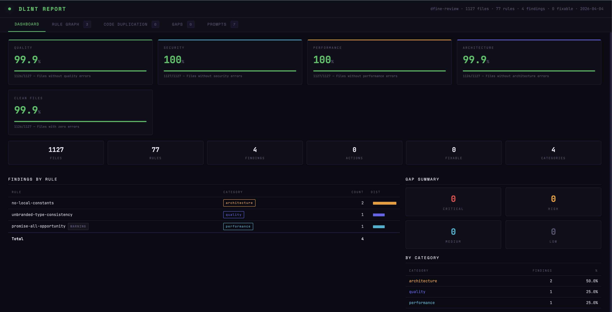
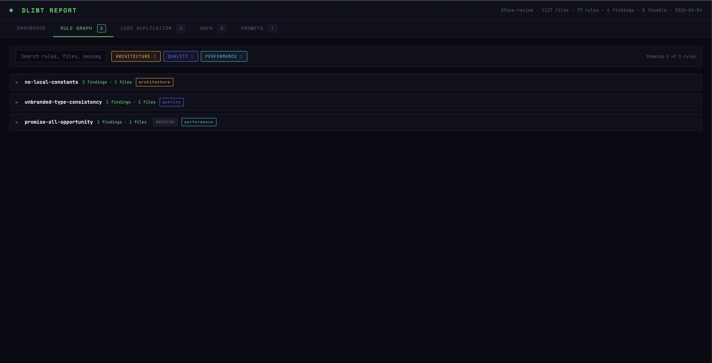

```
     ██████╗ ██╗     ██╗███╗   ██╗████████╗
     ██╔══██╗██║     ██║████╗  ██║╚══██╔══╝
     ██║  ██║██║     ██║██╔██╗ ██║   ██║
     ██║  ██║██║     ██║██║╚██╗██║   ██║
     ██████╔╝███████╗██║██║ ╚████║   ██║
     ╚═════╝ ╚══════╝╚═╝╚═╝  ╚═══╝   ╚═╝
```

<h3 align="center">
  Lint with the type system, not around it
</h3>

<p align="center">
  The TypeScript linter that runs on the compiler itself.<br/>
  No abstraction layer. No Language Server overhead. No runtime cost.<br/>
  89 built-in rules, security and secret scanning included. Full TypeChecker access, one shared compiler program.
</p>

<p align="center">
  <a href="#why">Why</a> · <a href="#built-in-rules">Built-in rules</a> · <a href="#getting-started">Getting started</a> · <a href="#writing-rules">Writing rules</a> · <a href="#configuration">Configuration</a> · <a href="#cli">CLI</a>
</p>

---

## Why

Linters that parse your code into their own AST and then re-analyze it are doing double work. TypeScript already built the AST. It already resolved every type, every symbol, every import chain. It already knows what's `null`, what's a `Promise`, and what's dead code.

**dlint doesn't reparse anything.** It runs directly on the TypeScript Compiler API — the same `ts.Program`, `ts.TypeChecker`, and `ts.LanguageService` that `tsc` uses. Zero abstraction. Zero conversion overhead. The type information your rules see is identical to what the compiler sees.

This is not "type-aware linting." This is the compiler itself, with a rule engine on top.

### What that means in practice

**You get deterministic results.** Same code, same types, same findings — every time. No heuristics, no pattern matching, no "this looks like it might be a problem." If the TypeChecker says the return type is `Promise<User | null>`, that's what your rule sees.

**You get zero overhead.** dlint creates the TypeScript program once and shares it across every file and every rule. There's no Language Server spinning up, no adapter translating between AST formats, no plugin system adding indirection. Adding 10 more rules costs milliseconds — they reuse the same compiled program.

**You get the full API surface.** Every method on `ts.TypeChecker` is available. Resolve symbols across files. Check assignability. Unwrap generics. Walk the type hierarchy. Detect structural patterns. If TypeScript can answer the question, your rule can ask it.

**It's local and private.** dlint analyzes your code the way `tsc` does and never sends it anywhere. It runs entirely on your machine: no network calls, no telemetry, no AI or cloud service in the pipeline. Your source — and any secret it scans for — never leaves your machine. Every finding is a pure function of your code and your config, so a clean run today is a clean run tomorrow.

### What you can enforce

Things that text-based linters structurally cannot express:

- "Every exported async function in a `use server` file must validate its input before any side effect"
- "No file in `app/feature-a/` may import from `app/feature-b/` — enforce route isolation"
- "Every `switch` on a discriminated union must handle all variants with a `never` default"
- "No `Promise` returned from an expression statement may go unhandled"
- "No function may exceed a cyclomatic complexity of 15"

These are type-level, cross-file, architectural constraints. They require the compiler. dlint gives you the compiler.

## Built-in rules

89 rules ship with the package. By default **62 run in any TypeScript project** — a clean, zero-config CI gate of universal bugs, security issues, and framework-guarded checks. The other **27 are opinionated** style/architecture rules (plus a few opinionated sub-checks); they ship in an **off-by-default `opinionated` group** you enable when you want them (see [Configuration](#configuration)).

| Category         | Rules                                                                                                                                                                                                                                                                                                                                                           | What they catch                                                                               |
| ---------------- | --------------------------------------------------------------------------------------------------------------------------------------------------------------------------------------------------------------------------------------------------------------------------------------------------------------------------------------------------------------- | --------------------------------------------------------------------------------------------- |
| **Quality**      | `no-floating-promises`, `no-misused-promises`, `exhaustive-switch`, `no-empty-function`, `no-useless-code`, `no-debug-code`, `no-redundant-zod-parse`, `banned-syntax`, `syntax`                                                                                                                                                                                | Unhandled promises, missing switch cases, dead code                                           |
| **Type Safety**  | `type-precision`, `typescript`, `narrow-param-type`, `unnecessary-type-assertion`, `any-propagation`, `await-non-thenable`, `no-base-to-string`, `unbranded-type-consistency`, `prefer-literal-union`, `prefer-satisfies-over-as`, `restrict-plus-operands`, `restrict-template-expr`                                                                           | Imprecise types, unsafe casts, `any` leaks, unbranded ids                                     |
| **Performance**  | `performance`, `promise-all-opportunity`, `cache-primitive-args`, `cache-caller-count`, `missing-returning`, `no-db-antipatterns`                                                                                                                                                                                                                               | Sequential awaits, unbounded queries, missing RETURNING                                       |
| **Security**     | `security`, `safety`, `input-validation`, `no-dynamic-sql`, `no-ssrf`, `no-page-params-unsafe-parse`, `no-implied-eval`, `unnecessary-use-server`, `no-child-process`, `no-non-literal-fs-path`, `no-non-literal-require`, `no-non-literal-regexp`, `no-weak-crypto`, `no-secrets`                                                                              | Auth gaps, injection, SSRF, command injection, path traversal, weak crypto, hardcoded secrets |
| **Correctness**  | `correctness`, `logic`, `error-handling`, `no-identical-binary-operands`, `no-unthrown-error`, `no-all-duplicated-branches`, `no-collection-size-mischeck`                                                                                                                                                                                                      | Logic errors, uncaught exceptions                                                             |
| **React**        | `react`, `rules-of-hooks`, `exhaustive-deps`, `effect-cleanup`, `state-hooks-cluster`, `no-async-client-component`, `no-client-data-fetch`, `no-unescaped-entities`, `jsx-no-useless-fragment`                                                                                                                                                                  | Hook violations, client/server boundary, render bugs                                          |
| **Style**        | `readability`, `simplification`, `naming-convention`, `duplicate-import`, `prefer-optional-chain`, `prefer-nullish-coalescing`, `prefer-modern-api`, `no-deprecated-api`, `deprecated-usage`, `no-underscore-prefix`, `no-implicit-coercion`, `no-magic-numbers`, `no-multiline-comments`, `no-css-properties`, `no-static-inline-style`, `css-class-existence` | Code clarity, modern patterns, CSS hygiene                                                    |
| **Architecture** | `unused-export`, `no-re-export`, `self-import`, `no-import-cycle`, `no-duplicated-constants`, `no-local-constants`, `max-file-lines`, `route-boundary`, `prop-drilling`, `zustand-patterns`, `no-client-server-only-import`, `no-db-origin-client-boundary`, `no-duplicate-schema-export`                                                                       | Dead exports, barrel files, boundary violations                                               |
| **Duplication**  | `semantic-clone`, `syntactic-clone`, `complexity`                                                                                                                                                                                                                                                                                                               | Copy-pasted logic, high complexity                                                            |

The 62 default rules run automatically on install — no configuration required. They stay silent on frameworks you don't use (the React/Next/Drizzle/Zod/Zustand checks are guarded by import/symbol resolution) and never enforce a style convention you didn't opt into. The 27 opinionated rules are one line away (below).

### Every rule, explained

<details>
<summary><strong>Quality</strong> — promises, dead code, footgun syntax</summary>

- `no-floating-promises` — An async call whose result you ignore can swallow errors; await it or add `.catch()`.
- `no-misused-promises` — Stops passing an async function where a plain one is expected (event handlers, effects).
- `exhaustive-switch` — A `switch` over a fixed set of values must handle every case (or have a default).
- `no-empty-function` — Flags empty function bodies so a stub doesn't ship by accident.
- `no-useless-code` — Removes no-ops: pointless string joins, `.call()`/`.apply()`, redundant object keys.
- `no-debug-code` — Catches leftover `debugger` statements before they ship.
- `no-redundant-zod-parse` — Skips re-validating data that's already typed to the schema — no double work.
- `banned-syntax` — Blocks footguns: `void`, labels, octal, `delete` on variables, global assignment.
- `syntax` — Nudges to modern JS: `const` over `var`, template strings, object shorthand.

</details>

<details>
<summary><strong>Type safety</strong> — keep types tight and honest</summary>

- `type-precision` — Nine checks that keep types specific and meaningful instead of vague.
- `typescript` — Compiler-powered catches: missing null checks, hidden `any`, unsafe index access, shadowed names.
- `narrow-param-type` — Suggests narrower parameter types when a function uses only part of what it accepts.
- `unnecessary-type-assertion` — Flags `as T` casts that do nothing — the type is already right.
- `any-propagation` — Tracks `any` leaking through assignments and returns, eroding safety.
- `await-non-thenable` — Flags `await` on something that isn't a Promise (a no-op that hints at a bug).
- `no-base-to-string` — Stops objects becoming `"[object Object]"` because they lack a real `toString()`.
- `unbranded-type-consistency` — Wants IDs to use branded types so a `userId` and a `postId` can't be mixed up.
- `prefer-literal-union` — Replace loose string comparisons with a precise set of allowed values.
- `prefer-satisfies-over-as` — Use `satisfies T` instead of `as T` on literals so types aren't silently widened.
- `restrict-plus-operands` — Only add things that are safe to add — no accidental string/number coercion.
- `restrict-template-expr` — Flags unsafe values stuffed into template strings.

</details>

<details>
<summary><strong>Performance</strong> — avoid slow patterns</summary>

- `performance` — Common slow spots: regex built in a loop, sync I/O, long chains, mutating arrays in callbacks.
- `promise-all-opportunity` — Spots awaits done one-by-one that could run together with `Promise.all`.
- `cache-primitive-args` — `React.cache` only works reliably with primitive arguments; flags the rest.
- `cache-caller-count` — `React.cache` only pays off with 2+ callers; flags single-use ones.
- `missing-returning` — Reminds you to add `.returning()` on a DB insert/update when you need the result.
- `no-db-antipatterns` — Blocks DB transactions the serverless driver doesn't support.

</details>

<details>
<summary><strong>Security</strong> — injection, secrets, unsafe code</summary>

- `security` — Classic web holes: prototype pollution, `dangerouslySetInnerHTML`, `javascript:` URLs, `document.write`.
- `safety` — Runtime footguns: bad constructor returns, promise-executor mistakes, non-atomic updates, `parseInt` without a radix.
- `input-validation` — Server actions must validate their input (Zod `safeParse`) before doing anything with it.
- `no-dynamic-sql` — Blocks raw SQL built from dynamic strings — the classic SQL-injection path.
- `no-ssrf` — Stops `fetch()` to a user-controlled URL in server code (server-side request forgery).
- `no-page-params-unsafe-parse` — Page params should fail gracefully, not crash — use a safe-parse helper.
- `no-implied-eval` — Flags running strings as code (`eval`, string `setTimeout`, `new Function`).
- `unnecessary-use-server` — Removes `"use server"` on code no client ever calls, shrinking the attack surface.
- `no-child-process` — Flags shell commands built from input (`exec`/`execSync`) — command injection.
- `no-non-literal-fs-path` — Flags file access with a path that comes from input — path traversal.
- `no-non-literal-require` — Flags `require()`/`import()` of a module name that comes from input.
- `no-non-literal-regexp` — Flags regexes built from input, which can hang on crafted strings (ReDoS).
- `no-weak-crypto` — Flags broken hash algorithms like MD5/SHA-1.
- `no-secrets` — Flags hardcoded API keys, tokens, and private keys in your code.

</details>

<details>
<summary><strong>Correctness</strong> — real bugs the compiler can prove</summary>

- `correctness` — Bug-prevention: self-assignment, unsafe `finally`, loops that run once, reassigned params.
- `logic` — Compiler-checked logic bugs: identical conditions, leaked renders, writes that are never read.
- `error-handling` — Catches empty `catch` blocks and errors thrown without a cause.
- `no-identical-binary-operands` — Both sides of an operator are identical (`a && a`, `x - x`) — redundant or always constant.
- `no-unthrown-error` — A `new Error()` built but never thrown — usually a forgotten `throw`.
- `no-all-duplicated-branches` — Every branch of an if/else or switch runs the same code — the condition decides nothing.
- `no-collection-size-mischeck` — A length/size check that is always true or false (`arr.length >= 0`).

</details>

<details>
<summary><strong>React</strong> — hooks, effects, client/server boundary</summary>

- `react` — React pitfalls: components nested in components, `setState` in effects, race conditions, missing button `type`.
- `rules-of-hooks` — Hooks must run at the top level — never in conditions, loops, or after a return.
- `exhaustive-deps` — Effect/callback/memo dependency arrays must list every value they use.
- `effect-cleanup` — Effects that add listeners or timers must clean them up.
- `state-hooks-cluster` — Flags tangled `useState` that should be one well-modeled state object.
- `no-async-client-component` — Client components can't be `async` — it crashes at runtime.
- `no-client-data-fetch` — Don't `fetch`/axios in a client component — use a server action.
- `no-unescaped-entities` — Flags raw HTML characters in JSX text that should be escaped.
- `jsx-no-useless-fragment` — Removes `<>…</>` fragments that wrap a single child for nothing.

</details>

<details>
<summary><strong>Style</strong> — clarity and modern patterns</summary>

- `readability` — Flags hard-to-read shapes: nested ternaries/switches, `this` aliasing.
- `simplification` — Simpler equivalents: drop useless `else`, collapse nested `if`, return immediately.
- `naming-convention` — Blocks shadowing built-in names and label-as-variable confusion.
- `duplicate-import` — Merges multiple imports from the same module into one.
- `prefer-optional-chain` — Use `a?.b` instead of `a && a.b`.
- `prefer-nullish-coalescing` — Use `??` instead of `||` for values that can be null/undefined.
- `prefer-modern-api` — Nudge to modern methods: `includes`, `flatMap`, `at`, `startsWith`, `Object.hasOwn`.
- `no-deprecated-api` — Blocks legacy footguns like `__proto__` and extending native prototypes.
- `deprecated-usage` — Flags use of anything marked `@deprecated`.
- `no-underscore-prefix` — Use real names instead of `_name`, or `_` for a deliberate discard.
- `no-implicit-coercion` — Flags sneaky conversions: `==`, `+x`, `'' + x`, `!!x`.
- `no-magic-numbers` — Pull unexplained numbers into named constants.
- `no-multiline-comments` — Use line comments, not `/** */` JSDoc blocks.
- `no-css-properties` — Don't type things as `CSSProperties` — use CSS Module classes.
- `no-static-inline-style` — No `style={{…}}` with static values — use a class.
- `css-class-existence` — Checks that a CSS-module class you reference actually exists.

</details>

<details>
<summary><strong>Architecture</strong> — boundaries, dead code, structure</summary>

- `unused-export` — Flags exports nothing else imports — dead public API.
- `no-re-export` — Import from the real source, not a pass-through barrel file.
- `self-import` — Flags a file importing itself.
- `no-import-cycle` — Detects circular imports between files.
- `no-duplicated-constants` — Flags local constants that just duplicate a central one.
- `no-local-constants` — `UPPER_SNAKE` constants belong in a central constants file.
- `max-file-lines` — Flags files that have grown too long.
- `route-boundary` — Keeps routes/features isolated so they don't reach into each other.
- `prop-drilling` — Flags components passing props straight through without using them.
- `zustand-patterns` — Enforces correct Zustand store usage (selectors, no store-in-effect).
- `no-client-server-only-import` — Client code must not pull in server-only modules.
- `no-db-origin-client-boundary` — Database row types must not leak to the client side.
- `no-duplicate-schema-export` — Two same-named schemas create incompatible types — flags it.

</details>

<details>
<summary><strong>Duplication</strong> — copy-paste and complexity</summary>

- `semantic-clone` — Finds functions that do the same thing with a different look (type-equivalent + similar body).
- `syntactic-clone` — Finds near-identical copy-pasted blocks across files.
- `complexity` — Flags functions that are too deep, too long, or too branchy.

</details>

## Secret scanning

`no-secrets` flags hardcoded credentials in string literals — AWS, GitHub, Stripe, Google, Slack, 1Password, Anthropic, private keys, and dozens more — by matching a curated, public pattern set ([`assets/secret-patterns.json`](assets/secret-patterns.json)). The set is **regex-deterministic**: distinctive vendor formats only, no entropy guessing, and every pattern uses **bounded quantifiers** so matching stays linear — no ReDoS, even on a 60 KB minified or base64 literal. Each pattern is validated against its own examples when loaded, and everything is matched locally. Refresh the set any time with `pnpm refresh-secret-patterns`.

The patterns are forked from [**gitleaks**](https://github.com/gitleaks/gitleaks) (MIT, © 2019 Zachary Rice) — credit where it's due. We keep only the formats that are unambiguous by prefix, verify each compiles as a bounded, ReDoS-safe JavaScript regex, drop non-secret formats (ARNs, public/publishable keys, URLs), and ship the result. See [THIRD-PARTY-LICENSES.md](THIRD-PARTY-LICENSES.md).

**Honest scope:** the secret scan is high-precision and _deliberately_ low-recall — it catches credentials with a known vendor format, not arbitrary high-entropy strings or secrets split across concatenations. The taint-based rules (`no-child-process`, `no-non-literal-*`) are likewise best-effort intra-procedural checks: they catch the common direct cases, not taint laundered through a helper or reassignment. Treat both as one layer of defense, **not** a guarantee that your code is clean.

## HTML Report

dlint generates an interactive HTML report with full project health visibility:

<p align="center">
  
</p>

The dashboard shows per-category scores (quality, security, performance, architecture), file-level compliance rates, findings by rule with distribution bars, and a gap summary by severity.

<p align="center">
  
</p>

The findings view provides searchable, filterable rule groups with category badges, severity indicators, and expandable file-level details. Additional tabs cover code duplication analysis, architectural gap detection, and AI-assisted fix prompts.

```bash
npx dlint --format html    # writes .dlint/report/<ddmmyy>_<hh>h<mm>_<project>_dlint-report.html (+ a .json sibling)
```

## Getting started

```bash
pnpm add -D @dfine-io-gmbh/dlint
```

```bash
npx dlint                  # all files
npx dlint --changed        # only uncommitted changes
npx dlint --branch         # everything on the current branch
npx dlint --format compact # one line per finding
```

Zero config. The 62 default rules work immediately as a CI gate; opt into the 27 opinionated rules via a group (see [Configuration](#configuration)).

### Use as a CI gate

`dlint` exits non-zero as soon as it finds an error, so it drops straight into any pipeline:

```bash
npx dlint --branch    # lint only what changed vs the base branch; fails the job on errors
```

Use `--no-error` to report findings without failing the build.

### Adding project-specific rules

When your project has architectural rules that go beyond the universal set, add them as `.ts` files:

```typescript
// dlint.config.ts
import type { DlintConfig } from "@dfine-io-gmbh/dlint";

export default {
  rulesDir: ".dlint/rules",
  severity: "error",
  include: ["**/*.ts", "**/*.tsx"],
  exclude: ["node_modules", ".next", "build"],
  tsconfig: "./tsconfig.json",
} satisfies DlintConfig;
```

Every `.ts` file in `.dlint/rules/` becomes a rule. Subdirectories work. The built-in universal rules load straight from the package and always run alongside your project-specific ones — they update with `pnpm update`, no sync step or copied rule files. A project rule with the same id overrides a built-in one.

## Agent skill (recommended)

This repo ships a portable **agent skill** — a `SKILL.md` knowledge pack any skill-aware coding
agent can load — that teaches authoring, testing, configuring, and shipping dlint rules. It
internalizes this README and the SDK, and enforces dlint's principles: compiler/TypeChecker-only,
no string heuristics, and a no-duplication gate that checks whether an existing rule +
`ruleOptions` already covers your case before you write a new one.

The skill lives at [`skills/dfine-lint/`](skills/dfine-lint) and ships in the npm package. Load it
by copying it into your agent's skills directory; it then triggers whenever you write or tune a
rule, a fixture, or `dlint.config.ts`:

```bash
# in your project, from the installed package
cp -r node_modules/@dfine-io-gmbh/dlint/skills/dfine-lint .claude/skills/
# or when working inside this repo
cp -r skills/dfine-lint .claude/skills/
```

## Writing rules

A rule receives the full TypeScript compiler context for each file. You walk the AST, query the TypeChecker, and report problems:

```typescript
import ts from "typescript";
import { defineRule } from "@dfine-io-gmbh/dlint";

// The rule id is the filename — save this as .dlint/rules/no-floating-promises.ts
export default defineRule({
  meta: {
    severity: "error",
    category: "quality",
    description: "Promise not awaited or caught",
  },
  check(ctx) {
    ctx.walk((node) => {
      if (
        ts.isExpressionStatement(node) &&
        ts.isCallExpression(node.expression)
      ) {
        const type = ctx.checker.getTypeAtLocation(node.expression);
        if (type.symbol?.name === "Promise") {
          ctx.reportAt(node, "Floating Promise — await or add .catch()", {
            action: "add-await",
            pattern: "await expression",
          });
        }
      }
    });
  },
});
```

### What you have access to

```typescript
check(ctx) {
  ctx.program       // ts.Program — the full compiled project
  ctx.checker       // ts.TypeChecker — resolve types, symbols, assignability
  ctx.sourceFile    // ts.SourceFile — the current file's AST
  ctx.referenceIndex // which exports are used where (cross-file)
  ctx.walk()        // visit every node in the current file
  ctx.reportAt()    // flag a problem at a specific location
}
```

This is the same API that `tsc` uses internally. No wrapper. No adapter. No subset.

### Helpers

<details>
<summary>28 typed helpers over the native TypeScript API — no conversion layer</summary>

| Helper                      | What it does                                                 |
| --------------------------- | ------------------------------------------------------------ |
| `defineRule`                | Create a rule with typed context and metadata                |
| `defineExtractor`           | Create an extractor for cross-rule data collection           |
| `hasDirective`              | Check file-level directives (`"use server"`, `"use client"`) |
| `getExportedFunctions`      | All exports — arrow functions, declarations, expressions     |
| `isInsideLoop`              | Parent-chain check, stops at function boundary               |
| `isNullableType`            | Does the type include `null` or `undefined`?                 |
| `hasOwnToString`            | Does the type have its own `toString()`?                     |
| `isLibDeclaration`          | Is this from `lib.dom.d.ts` or a built-in?                   |
| `isNodeModulesDeclaration`  | Is this from `node_modules`?                                 |
| `isInConditionalBranch`     | Is the node inside an `if`/ternary branch?                   |
| `isInBooleanContext`        | Is the node in a boolean position?                           |
| `resolveSymbol`             | Cross-file symbol resolution via TypeChecker                 |
| `isAssignableTo`            | Structural type compatibility check                          |
| `unwrapPromiseType`         | Extract `T` from `Promise<T>`                                |
| `isBuiltinCollection`       | Is it `Map`, `Set`, or `Array`?                              |
| `hasJsDocTag`               | Check JSDoc annotations on declarations                      |
| `isDbCall`                  | Detect ORM/database call expressions                         |
| `returnTypeHasProperties`   | Check if return type has specific fields                     |
| `isFromPackage`             | Is the import from a specific npm package?                   |
| `resolveCallBody`           | Resolve function body across file boundaries                 |
| `bodyContainsCall`          | Does a function body call a specific function?               |
| `tokenizeFile`              | Extract normalized token blocks for clone detection          |
| `tokenSimilarity`           | Bigram Jaccard coefficient between token sequences           |
| `collectTypeDeclarations`   | Discover all interfaces and type aliases                     |
| `collectFunctionSignatures` | Extract function signature fingerprints                      |
| `memberJaccard`             | Type member similarity score                                 |
| `signatureKey`              | Deterministic function signature hash                        |
| `buildReferenceIndex`       | Cross-file export usage tracking                             |

</details>

## Configuration

```typescript
import type { DlintConfig } from "@dfine-io-gmbh/dlint";

export default {
  bundledRules: true, // load the package's universal rules (default; false to opt out)
  rulesDir: ".dlint/rules", // project-specific rules (optional; override bundled by id)
  severity: "error", // default severity
  include: ["**/*.ts", "**/*.tsx"], // what to scan
  exclude: ["node_modules", ".next"], // what to skip
  tsconfig: "./tsconfig.json", // your project's tsconfig
  maxFileSize: 500_000, // skip files larger than 500KB
  referencesDir: ".dlint/references", // advisory docs for rules
  groups: [
    // opt into the opinionated rule set (ships off by default)
    { id: "opinionated", severity: "error" },
  ],
  overrides: [
    // per-rule severity tuning (wins over groups and the default)
    { ruleId: "no-magic-numbers", severity: "warning" },
    { ruleId: "max-file-lines", severity: "off" },
  ],
} satisfies DlintConfig;
```

### Rule groups

Rules are bundled into **groups** you toggle with a single severity. The package ships one built-in group, **`opinionated`**, set to `off` — it holds the 27 style/architecture rules (plus a few opinionated sub-checks) a generic project may not share. Enable the whole set in one line:

```typescript
export default {
  groups: [{ id: "opinionated", severity: "error" }],
} satisfies DlintConfig;
```

Precedence, most specific wins: a per-rule `override` → the rule's own declared severity → its group → the global default. So you can enable the group and still silence one rule via `overrides`, or target a single sub-check with `{ ruleId: "typescript:no-explicit-any", severity: "off" }`.

**Build your own groups** — bundle rules by concern and flip them as one. A group with a new `id` brings its own `rules`; a group reusing a built-in `id` just re-sets that group's severity:

```typescript
export default {
  groups: [
    { id: "opinionated", severity: "error" }, // enable the built-in set
    // your own group: toggle a concern together (here: report, don't fail CI)
    {
      id: "soft",
      severity: "warning",
      rules: ["no-base-to-string", "exhaustive-switch", "no-floating-promises"],
    },
  ],
} satisfies DlintConfig;
```

### Rule options

Each rule's tunable values (the `CONFIG` block at the top of the rule file) are **defaults**. Override them per project in `ruleOptions`, keyed by rule id — **without copying the rule**, so the rule's logic stays single-sourced and keeps improving with `pnpm update`:

```typescript
export default {
  ruleOptions: {
    "max-file-lines": { maxLines: 500 },
    "no-magic-numbers": { ignoredNumbers: [0, 1, -1, 2, 100] },
    complexity: { maxComplexity: 20, maxDepth: 5 },
    "route-boundary": {
      appDir: "src/app",
      allowedPairs: [["checkout", "cart"]],
    },
    "unbranded-type-consistency": {
      externalIdNames: ["deviceId", "videoDeviceId"],
    },
  },
} satisfies DlintConfig;
```

Each `CONFIG` const maps to a camelCase option key (`MAX_LINES` → `maxLines`, `EXTERNAL_ID_NAMES` → `externalIdNames`). Options apply across all files and combine freely with `overrides` (severity, file scope) and `groups`.

**The `opinionated` group:** `any-propagation`, `cache-caller-count`, `complexity`, `duplicate-import`, `error-handling`, `max-file-lines`, `narrow-param-type`, `no-css-properties`, `no-duplicated-constants`, `no-empty-function`, `no-local-constants`, `no-magic-numbers`, `no-multiline-comments`, `no-re-export`, `no-static-inline-style`, `no-underscore-prefix`, `prefer-literal-union`, `prefer-satisfies-over-as`, `promise-all-opportunity`, `readability`, `route-boundary`, `semantic-clone`, `simplification`, `syntactic-clone`, `type-precision`, `unbranded-type-consistency`, `unused-export` — plus the opinionated sub-checks of `performance`, `typescript`, and `no-implicit-coercion` (their universal sub-checks stay on).

## CLI

```
npx dlint [options]            Lint (default: full project scan)
npx dlint init                 Scaffold .dlint/rules + dlint.config.ts
npx dlint --help, -h           Show all flags

Scan modes (default: full project):
  --files <path...>     Specific files or directories
  --changed             Uncommitted + untracked files
  --commit              Last commit + uncommitted changes
  --branch              All changes vs base branch

Config & target:
  --config <file>       Load this config; rulesDir + tsconfig resolve from its directory
  --path <dir>          Project root (default: cwd)
  --rules <id...>       Only run specific rules

Output:
  --format <fmt>        json (default) | table | compact | html
  --benchmark           Total run timing (table format)
  --file-threshold <n>  Write report to /tmp when findings >= n (default 300)
  --no-error            Exit 0 even when errors are found

Autofix:
  --fix                 Apply available autofixes
  --dry-run             With --fix: show what would change, write nothing

Analysis:
  --extract             Output extractor data as JSON
```

### Run from anywhere

`--config <file>` decouples _where the config lives_ from the cwd: its `rulesDir`, `tsconfig`, and scan base all resolve **relative to the config file's directory**. So one rule set can lint several programs in a monorepo (app + workers + packages), each pointing at its own `tsconfig` — run one config per program, e.g. in a CI loop:

```bash
dlint --config app.dlint.config.ts
dlint --config worker.dlint.config.ts   # same rulesDir, the worker's own tsconfig
```

Two things make dlint scan **nothing** silently (no error, zero findings): a `tsconfig` that doesn't include the files, and running outside a git repo — the default scan and `--changed`/`--commit`/`--branch` enumerate files via git. Disable rules that don't fit a target's runtime via `overrides`.

## Performance

One `ts.Program`, one `ts.TypeChecker`, built once and shared across every file and every rule — so run time is dominated by TypeScript's own program creation, and the per-rule pass is cheap on top of it. Adding 10 more rules costs milliseconds, not seconds.

Lint only what you touched with `--changed` (uncommitted) or `--branch` (vs base) instead of the whole project.

## How it works

```
install package
  → 89 built-in rules loaded (62 active by default; the opinionated group ships off)
  → project-specific rules loaded from .dlint/rules/ (optional)
  → create ts.Program (once, shared)
  → for each file x each rule: check(ctx)
  → collect diagnostics → format → output
```

Rules are `.ts` files compiled at runtime via [jiti](https://github.com/unjs/jiti). No build step. Drop a file in `.dlint/rules/`, it runs on the next invocation.

100% TypeScript. 100% type-safe. 100% deterministic.

## License

MIT — built by [dfine.io](https://dfine.io)

The bundled secret patterns are forked from [gitleaks](https://github.com/gitleaks/gitleaks) (MIT, © 2019 Zachary Rice) — see [THIRD-PARTY-LICENSES.md](THIRD-PARTY-LICENSES.md).
