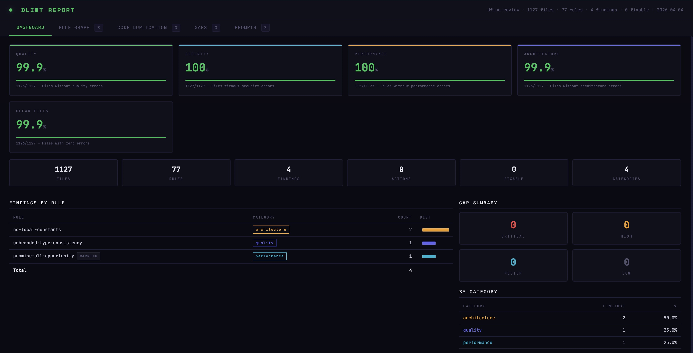
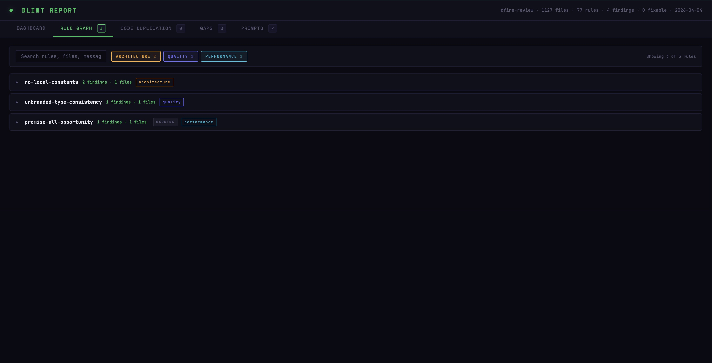

```
     ██████╗ ██╗     ██╗███╗   ██╗████████╗
     ██╔══██╗██║     ██║████╗  ██║╚══██╔══╝
     ██║  ██║██║     ██║██╔██╗ ██║   ██║
     ██║  ██║██║     ██║██║╚██╗██║   ██║
     ██████╔╝███████╗██║██║ ╚████║   ██║
     ╚═════╝ ╚══════╝╚═╝╚═╝  ╚═══╝   ╚═╝
```

<h3 align="center">
  Lint with the type system, not around it
</h3>

<p align="center">
  A TypeScript linter that runs on the compiler itself, without an AST conversion layer or a language server.<br/>
  86 built-in rules, security checks and secret scanning included, all with full TypeChecker access on one shared compiler program.
</p>

<p align="center">
  <a href="#why">Why</a> · <a href="#built-in-rules">Built-in rules</a> · <a href="#getting-started">Getting started</a> · <a href="#writing-rules">Writing rules</a> · <a href="#configuration">Configuration</a> · <a href="#cli">CLI</a>
</p>

---

## Why

Linters that parse your code into their own AST and analyze it again repeat work TypeScript has already done. The compiler has built the AST, resolved every type, symbol and import, and knows which values can be `null`, which are a `Promise`, and which code is dead.

dlint does not parse your code again. It runs on the TypeScript Compiler API, on the same `ts.Program` and `ts.TypeChecker` that `tsc` uses, so your rules see exactly the type information the compiler sees.

### What that means in practice

Results are deterministic: the same code and types always give the same findings. Rules read types from the TypeChecker instead of guessing from text patterns, so if it says a return type is `Promise<User | null>`, that is what the rule sees.

dlint creates the TypeScript program once and shares it across every file and rule. No language server starts, and no adapter converts between AST formats. Every rule reuses the same compiled program.

Rules get the whole `ts.TypeChecker` API: they can resolve symbols across files, check assignability, unwrap generics and walk the type hierarchy. Any question TypeScript can answer, a rule can ask.

dlint runs entirely on your machine. It makes no network calls, sends no telemetry and uses no AI or cloud service, so your source code and any secret it finds stay local. A finding depends only on your code, the types of its dependencies, your config and the dlint version, so a clean run stays clean until one of them changes.

### What you can enforce

These constraints need types and cross-file information, so a text-based linter cannot express them:

- "Every exported async function in a `use server` file must validate its input before any side effect"
- "No file in `app/feature-a/` may import from `app/feature-b/` (route isolation)"
- "Every `switch` on a discriminated union must handle all variants with a `never` default"
- "No `Promise` returned from an expression statement may go unhandled"
- "No function may exceed a cyclomatic complexity of 15"

## Built-in rules

86 rules ship with the package. 61 of them run by default in any TypeScript project and work as a zero-config CI gate for bugs, security issues and framework checks. The other 25 are opinionated style and architecture rules (plus a few opinionated sub-checks). They sit in the `opinionated` group, which stays off until you enable it (see [Configuration](#configuration)).

| Category         | Rules                                                                                                                                                                                                                                                                                                                                                           | What they catch                                                                               |
| ---------------- | --------------------------------------------------------------------------------------------------------------------------------------------------------------------------------------------------------------------------------------------------------------------------------------------------------------------------------------------------------------- | --------------------------------------------------------------------------------------------- |
| **Quality**      | `no-floating-promises`, `no-misused-promises`, `exhaustive-switch`, `no-empty-function`, `no-useless-code`, `no-debug-code`, `no-redundant-zod-parse`, `banned-syntax`, `syntax`                                                                                                                                                                                | Unhandled promises, missing switch cases, dead code                                           |
| **Type Safety**  | `type-precision`, `typescript`, `narrow-param-type`, `unnecessary-type-assertion`, `any-propagation`, `await-non-thenable`, `no-base-to-string`, `unbranded-type-consistency`, `prefer-literal-union`, `prefer-satisfies-over-as`, `restrict-plus-operands`, `restrict-template-expr`                                                                           | Imprecise types, unsafe casts, `any` leaks, unbranded ids                                     |
| **Performance**  | `performance`, `promise-all-opportunity`, `cache-primitive-args`, `cache-caller-count`, `missing-returning`, `no-db-antipatterns`                                                                                                                                                                                                                               | Sequential awaits, unbounded queries, missing RETURNING                                       |
| **Security**     | `security`, `safety`, `input-validation`, `no-dynamic-sql`, `no-ssrf`, `no-page-params-unsafe-parse`, `no-implied-eval`, `unnecessary-use-server`, `no-child-process`, `no-non-literal-fs-path`, `no-non-literal-require`, `no-non-literal-regexp`, `no-weak-crypto`, `no-secrets`                                                                              | Auth gaps, injection, SSRF, command injection, path traversal, weak crypto, hardcoded secrets |
| **Correctness**  | `correctness`, `logic`, `error-handling`, `no-identical-binary-operands`, `no-unthrown-error`, `no-all-duplicated-branches`, `no-collection-size-mischeck`                                                                                                                                                                                                      | Logic errors, uncaught exceptions                                                             |
| **React**        | `react`, `rules-of-hooks`, `exhaustive-deps`, `effect-cleanup`, `state-hooks-cluster`, `no-async-client-component`, `no-client-data-fetch`, `no-unescaped-entities`, `jsx-no-useless-fragment`                                                                                                                                                                  | Hook violations, client/server boundary, render bugs                                          |
| **Style**        | `readability`, `simplification`, `naming-convention`, `duplicate-import`, `prefer-optional-chain`, `prefer-nullish-coalescing`, `prefer-modern-api`, `no-deprecated-api`, `deprecated-usage`, `no-underscore-prefix`, `no-implicit-coercion`, `no-magic-numbers`, `no-multiline-comments` | Code clarity, modern patterns                                                    |
| **Architecture** | `unused-export`, `no-re-export`, `self-import`, `no-import-cycle`, `no-duplicated-constants`, `no-local-constants`, `max-file-lines`, `route-boundary`, `prop-drilling`, `zustand-patterns`, `no-client-server-only-import`, `no-db-origin-client-boundary`, `no-duplicate-schema-export`                                                                       | Dead exports, barrel files, boundary violations                                               |
| **Duplication**  | `semantic-clone`, `syntactic-clone`, `complexity`                                                                                                                                                                                                                                                                                                               | Copy-pasted logic, high complexity                                                            |

The 61 default rules need no configuration. The React, Next, Drizzle, Zod and Zustand checks first look for their framework through imports, symbols, directives or a type's shape, so they stay silent in a project that doesn't use it. Enabling the 25 opinionated rules takes one line (see below).

### Every rule, explained

<details>
<summary><strong>Quality</strong>: promises, dead code, footgun syntax</summary>

- `no-floating-promises`: An async call whose result you ignore can swallow errors; await it or add `.catch()`.
- `no-misused-promises`: Stops passing an async function where a plain one is expected (event handlers, effects).
- `exhaustive-switch`: A `switch` over a fixed set of values must handle every case (or have a default).
- `no-empty-function`: Flags empty function bodies so a stub doesn't ship by accident.
- `no-useless-code`: Removes no-ops: pointless string joins, `.call()`/`.apply()`, redundant object keys.
- `no-debug-code`: Catches leftover `debugger` statements before they ship.
- `no-redundant-zod-parse`: Skips re-validating data that is already typed to the schema.
- `banned-syntax`: Blocks footguns: `void`, labels, octal, `delete` on variables, global assignment.
- `syntax`: Nudges to modern JS: `const` over `var`, template strings, object shorthand.

</details>

<details>
<summary><strong>Type safety</strong>: keep types tight and honest</summary>

- `type-precision`: Nine checks that keep types specific and meaningful instead of vague.
- `typescript`: Compiler-powered catches: missing null checks, hidden `any`, unsafe index access, shadowed names.
- `narrow-param-type`: Suggests narrower parameter types when a function uses only part of what it accepts.
- `unnecessary-type-assertion`: Flags `as T` casts that change nothing because the type already matches.
- `any-propagation`: Tracks `any` leaking through assignments and returns, eroding safety.
- `await-non-thenable`: Flags `await` on something that isn't a Promise (a no-op that hints at a bug).
- `no-base-to-string`: Stops objects becoming `"[object Object]"` because they lack a real `toString()`.
- `unbranded-type-consistency`: Wants IDs to use branded types so a `userId` and a `postId` can't be mixed up.
- `prefer-literal-union`: Replace loose string comparisons with a precise set of allowed values.
- `prefer-satisfies-over-as`: Use `satisfies T` instead of `as T` on literals so types aren't silently widened.
- `restrict-plus-operands`: Allows `+` only on operands that are safe to add, so strings and numbers don't mix by accident.
- `restrict-template-expr`: Flags unsafe values stuffed into template strings.

</details>

<details>
<summary><strong>Performance</strong>: avoid slow patterns</summary>

- `performance`: Common slow spots: regex built in a loop, sync I/O, long chains, mutating arrays in callbacks.
- `promise-all-opportunity`: Spots awaits done one-by-one that could run together with `Promise.all`.
- `cache-primitive-args`: `React.cache` only works reliably with primitive arguments; flags the rest.
- `cache-caller-count`: `React.cache` only pays off with 2+ callers; flags single-use ones.
- `missing-returning`: Reminds you to add `.returning()` on a DB insert/update when you need the result.
- `no-db-antipatterns`: Blocks DB transactions the serverless driver doesn't support, and per-row queries in a loop (N+1).

</details>

<details>
<summary><strong>Security</strong>: injection, secrets, unsafe code</summary>

- `security`: Classic web holes: prototype pollution, `dangerouslySetInnerHTML`, `javascript:` URLs, `document.write`.
- `safety`: Runtime footguns: bad constructor returns, promise-executor mistakes, non-atomic updates, `parseInt` without a radix.
- `input-validation`: Server actions must validate their input (Zod `safeParse`) before doing anything with it.
- `no-dynamic-sql`: Blocks raw SQL built from dynamic strings, the classic SQL-injection path.
- `no-ssrf`: Stops `fetch()` to a user-controlled URL in server code (server-side request forgery).
- `no-page-params-unsafe-parse`: Page params should fail gracefully instead of crashing: use a safe-parse helper.
- `no-implied-eval`: Flags running strings as code (`eval`, string `setTimeout`, `new Function`).
- `unnecessary-use-server`: Removes `"use server"` on code no client ever calls, shrinking the attack surface.
- `no-child-process`: Flags shell commands built from input (`exec`/`execSync`), a command-injection risk.
- `no-non-literal-fs-path`: Flags file access with a path that comes from input, a path-traversal risk.
- `no-non-literal-require`: Flags `require()`/`import()` of a module name that comes from input.
- `no-non-literal-regexp`: Flags regexes built from input, which can hang on crafted strings (ReDoS).
- `no-weak-crypto`: Flags broken hash algorithms like MD5/SHA-1.
- `no-secrets`: Flags hardcoded API keys, tokens, and private keys in your code.

</details>

<details>
<summary><strong>Correctness</strong>: real bugs the compiler can prove</summary>

- `correctness`: Bug-prevention: self-assignment, unsafe `finally`, loops that run once, reassigned params.
- `logic`: Compiler-checked logic bugs: identical conditions, leaked renders, writes that are never read.
- `error-handling`: Catches empty `catch` blocks and errors thrown without a cause.
- `no-identical-binary-operands`: Both sides of an operator are identical (`a && a`, `x - x`), which is redundant or always constant.
- `no-unthrown-error`: A `new Error()` built but never thrown, usually a forgotten `throw`.
- `no-all-duplicated-branches`: Every branch of an if/else or switch runs the same code, so the condition decides nothing.
- `no-collection-size-mischeck`: A length/size check that is always true or false (`arr.length >= 0`).

</details>

<details>
<summary><strong>React</strong>: hooks, effects, client/server boundary</summary>

- `react`: React pitfalls: components nested in components, `setState` in effects, race conditions, missing button `type`.
- `rules-of-hooks`: Hooks must run at the top level, never in conditions, loops, or after a return.
- `exhaustive-deps`: Effect/callback/memo dependency arrays must list every value they use.
- `effect-cleanup`: Effects that add listeners or timers must clean them up.
- `state-hooks-cluster`: Flags tangled `useState` that should be one well-modeled state object.
- `no-async-client-component`: Client components can't be `async`; it crashes at runtime.
- `no-client-data-fetch`: Don't call `fetch`/axios in a client component; use a server action.
- `no-unescaped-entities`: Flags raw HTML characters in JSX text that should be escaped.
- `jsx-no-useless-fragment`: Removes `<>…</>` fragments that wrap a single child for nothing.

</details>

<details>
<summary><strong>Style</strong>: clarity and modern patterns</summary>

- `readability`: Flags hard-to-read shapes: nested ternaries/switches, `this` aliasing.
- `simplification`: Simpler equivalents: drop useless `else`, collapse nested `if`, return immediately.
- `naming-convention`: Blocks shadowing built-in names and label-as-variable confusion.
- `duplicate-import`: Merges multiple imports from the same module into one.
- `prefer-optional-chain`: Use `a?.b` instead of `a && a.b`.
- `prefer-nullish-coalescing`: Use `??` instead of `||` for values that can be null/undefined.
- `prefer-modern-api`: Nudge to modern methods: `includes`, `flatMap`, `at`, `startsWith`, `Object.hasOwn`.
- `no-deprecated-api`: Blocks legacy footguns like `__proto__` and extending native prototypes.
- `deprecated-usage`: Flags use of anything marked `@deprecated`.
- `no-underscore-prefix`: Use real names instead of `_name`, or `_` for a deliberate discard.
- `no-implicit-coercion`: Flags sneaky conversions: `==`, `+x`, `'' + x`, `!!x`.
- `no-magic-numbers`: Pull unexplained numbers into named constants.
- `no-multiline-comments`: Use line comments, not `/** */` JSDoc blocks.

</details>

<details>
<summary><strong>Architecture</strong>: boundaries, dead code, structure</summary>

- `unused-export`: Flags exports that nothing imports (dead public API).
- `no-re-export`: Import from the real source, not a pass-through barrel file.
- `self-import`: Flags a file importing itself.
- `no-import-cycle`: Detects circular imports between files.
- `no-duplicated-constants`: Flags local constants that just duplicate a central one.
- `no-local-constants`: `UPPER_SNAKE` constants belong in a central constants file.
- `max-file-lines`: Flags files that have grown too long.
- `route-boundary`: Keeps routes/features isolated so they don't reach into each other.
- `prop-drilling`: Flags components passing props straight through without using them.
- `zustand-patterns`: Enforces correct Zustand store usage (selectors, no store-in-effect).
- `no-client-server-only-import`: Client code must not pull in server-only modules.
- `no-db-origin-client-boundary`: Database row types must not leak to the client side.
- `no-duplicate-schema-export`: Flags two same-named schemas, which create incompatible types.

</details>

<details>
<summary><strong>Duplication</strong>: copy-paste and complexity</summary>

- `semantic-clone`: Finds functions that do the same thing with a different look (type-equivalent + similar body).
- `syntactic-clone`: Finds near-identical copy-pasted blocks across files.
- `complexity`: Flags functions that are too deep, too long, or too branchy.

</details>

## Secret scanning

`no-secrets` flags hardcoded credentials in string literals, such as keys for AWS, GitHub, Stripe, Google, Slack, 1Password and Anthropic, private keys, and dozens more formats. It matches a curated public pattern set ([`assets/secret-patterns.json`](assets/secret-patterns.json)) of distinctive vendor formats, with no entropy guessing. Every pattern uses bounded quantifiers, so matching stays linear and cannot hang on crafted input (ReDoS), even on a 60 KB minified or base64 literal. Each pattern is checked against its own examples when it loads, and all matching happens locally. `pnpm refresh-secret-patterns` refreshes the set.

The patterns are forked from [gitleaks](https://github.com/gitleaks/gitleaks) (MIT, © 2019 Zachary Rice). dlint keeps only the formats that are unambiguous by prefix, checks that each compiles to a bounded, ReDoS-safe JavaScript regex, and drops formats that are not secrets (ARNs, public or publishable keys, URLs). See [THIRD-PARTY-LICENSES.md](THIRD-PARTY-LICENSES.md).

**Scope:** the secret scan favors precision over recall. It catches credentials with a known vendor format, but not arbitrary high-entropy strings or secrets split across concatenations. The taint-based rules (`no-child-process`, `no-non-literal-*`) are best-effort checks within one function: they catch direct cases, but not input passed through a helper or a reassignment. Treat both as one layer of defense, not as proof that the code is clean.

## HTML report

`--format html` writes an interactive report of the project's health:

<p align="center">
  
</p>

The dashboard shows per-category scores (quality, security, performance, architecture), file-level compliance rates, findings by rule with distribution bars, and a gap summary by severity.

<p align="center">
  
</p>

The findings view has searchable, filterable rule groups with category badges, severity indicators and expandable file-level details. Further tabs cover code duplication, architectural gaps, and fix prompts to hand to a coding agent.

```bash
npx dlint --format html    # writes .dlint/report/<ddmmyy>_<hh>h<mm>_<project>_dlint-report.html (+ a .json sibling)
```

## Getting started

```bash
pnpm add -D @dfine-io-gmbh/dlint
```

```bash
npx dlint                  # all files
npx dlint --changed        # only uncommitted changes
npx dlint --branch         # everything on the current branch
npx dlint --format compact # one line per finding
```

No config is needed: the 61 default rules work as a CI gate right away. Opt into the 25 opinionated rules through a group (see [Configuration](#configuration)).

> **TypeScript 7 / tsgo:** dlint carries its own JavaScript-based TypeScript engine (6.x, the last
> JavaScript-based line) and analyzes your code with it, independent of the compiler your project
> builds with. A project can move to the Go-native TypeScript 7 (`tsgo`) and dlint keeps linting
> it. A port to the native TS 7.1 API is on the roadmap.

### Use as a CI gate

`dlint` exits with a non-zero code when a run finds an error, so any pipeline can use it as a gate:

```bash
npx dlint --branch    # lint only what changed vs the base branch; fails the job on errors
```

Use `--no-error` to report findings without failing the build. `--branch` needs the base branch in the clone (for example `fetch-depth: 0` in `actions/checkout`); without it dlint exits 2.

### Adding project-specific rules

When your project has architectural rules that go beyond the universal set, add them as `.ts` files:

```typescript
// dlint.config.ts
import type { DlintConfig } from "@dfine-io-gmbh/dlint";

export default {
  rulesDir: ".dlint/rules",
  severity: "error",
  include: ["**/*.ts", "**/*.tsx"],
  exclude: ["node_modules", ".next", "build"],
  tsconfig: "./tsconfig.json",
} satisfies DlintConfig;
```

Every `.ts` file in `.dlint/rules/`, subdirectories included, becomes a rule. The built-in rules load from the package and run alongside your own. They update with `pnpm update`, without a sync step or copied rule files. A project rule with the same id overrides a built-in one.

A rule file that cannot be loaded, for example one that throws on import or whose `meta` has no `description`, is skipped and named in the output instead of failing the whole run. The lint still runs with the remaining rules, and `--format json` lists the skipped files under `skippedRules`.

### Type-checking your rules

Rules are loaded through jiti, which strips types at runtime. An unchecked type error therefore never crashes; it turns into a silent wrong value. `dlint init` writes a `.dlint/tsconfig.json` for this. In an existing project, add it yourself:

```json
{
  "extends": "@dfine-io-gmbh/dlint/tsconfig.rules.json",
  "include": ["rules/**/*.ts"]
}
```

```bash
npx tsc -p .dlint/tsconfig.json
```

The shipped config points `typescript` at the compiler dlint bundles, so your rules are checked against the same engine that runs them. That matters when your project builds with a different TypeScript, for example the Go-native 7.x, whose package exposes no types to check against.

## Agent skill (recommended)

This repo ships a portable agent skill: a `SKILL.md` knowledge pack that any skill-aware coding
agent can load. It teaches how to write, test, configure and ship dlint rules, draws on this
README and the SDK, and applies dlint's principles: compiler and TypeChecker only, no string
heuristics, and a duplication check that asks whether an existing rule plus `ruleOptions` already
covers your case before you write a new one.

The skill lives at [`skills/dfine-lint/`](skills/dfine-lint) and ships in the npm package. Load it
by copying it into your agent's skills directory; it then triggers whenever you write or tune a
rule, a fixture, or `dlint.config.ts`:

```bash
# in your project, from the installed package
cp -r node_modules/@dfine-io-gmbh/dlint/skills/dfine-lint .claude/skills/
# or when working inside this repo
cp -r skills/dfine-lint .claude/skills/
```

## Writing rules

A rule receives the full TypeScript compiler context for each file. You walk the AST, query the TypeChecker, and report problems:

```typescript
import ts from "typescript";
import { defineRule } from "@dfine-io-gmbh/dlint";

// The rule id is the filename — save this as .dlint/rules/no-floating-promises.ts
export default defineRule({
  meta: {
    severity: "error",
    category: "quality",
    description: "Promise not awaited or caught",
  },
  check(ctx) {
    ctx.walk((node) => {
      if (
        ts.isExpressionStatement(node) &&
        ts.isCallExpression(node.expression)
      ) {
        const type = ctx.checker.getTypeAtLocation(node.expression);
        if (type.symbol?.name === "Promise") {
          ctx.reportAt(node, "Floating Promise — await or add .catch()", {
            action: "add-await",
            pattern: "await expression",
          });
        }
      }
    });
  },
});
```

### What you have access to

```typescript
check(ctx) {
  ctx.program       // ts.Program — the full compiled project
  ctx.checker       // ts.TypeChecker — resolve types, symbols, assignability
  ctx.sourceFile    // ts.SourceFile — the current file's AST
  ctx.referenceIndex // which exports are used where (cross-file)
  ctx.walk()        // visit every node in the current file
  ctx.reportAt()    // flag a problem at a specific location
}
```

It is the same API `tsc` uses internally, with no wrapper or adapter in between and nothing left out.

### Helpers

<details>
<summary>Typed helpers over the native TypeScript API, no conversion layer</summary>

| Helper                      | What it does                                                 |
| --------------------------- | ------------------------------------------------------------ |
| `defineRule`                | Create a rule with typed context and metadata                |
| `defineExtractor`           | Create an extractor for cross-rule data collection           |
| `hasDirective`              | Check file-level directives (`"use server"`, `"use client"`) |
| `getExportedFunctions`      | Functions exported from this file, export lists included     |
| `isInsideLoop`              | Does it run per loop iteration? Stops at function boundary   |
| `isNullableType`            | Does the type (or constraint) include `null` or `undefined`? |
| `hasOwnToString`            | Does the type have its own `toString()`?                     |
| `isStringType`              | Is the type a string: literal, template, mapping or union?   |
| `isLibDeclaration`          | Is this from TypeScript's own `lib.*.d.ts`?                  |
| `isNodeModulesDeclaration`  | Is this from `node_modules`?                                 |
| `isInConditionalBranch`     | Inside an `if`/`else` or ternary branch, not the condition?  |
| `isInBooleanContext`        | Is the node in a boolean position?                           |
| `resolveSymbol`             | Cross-file symbol resolution via TypeChecker                 |
| `isAssignableTo`            | Structural type compatibility check                          |
| `unwrapPromiseType`         | Extract `T` from `Promise<T>`                                |
| `isBuiltinCollection`       | Is it `Map`, `Set`, or `Array`, readonly forms included?     |
| `hasJsDocTag`               | Check JSDoc annotations on declarations                      |
| `isDbCall`                  | Detect ORM/database call expressions                         |
| `dbRootMethod`              | Method called on the DB handle of a call chain               |
| `returnTypeHasProperties`   | Check if return type has specific fields                     |
| `isFromPackage`             | Is the import from a specific npm package?                   |
| `resolveCallBody`           | Resolve function body across file boundaries                 |
| `bodyContainsCall`          | Does a function body call a specific function?               |
| `resolveImportedModule`     | Resolve an import specifier the way the program does         |
| `collectValueImports`       | Specifiers a file loads at runtime, `import()` included      |
| `isTypeOnlyImport`          | Does an import or re-export pull no runtime value?           |
| `isWriteTarget`             | Is the expression assigned, incremented or deleted?          |
| `valueSymbolOf`             | The variable an identifier names, `{ a }` shorthand included |
| `isSameReference`           | Do two expressions name the same variable or property?       |
| `isThenable`                | Does the type have a callable `then`?                        |
| `tokenizeFile`              | Extract normalized token blocks for clone detection          |
| `tokenSimilarity`           | Bigram Jaccard coefficient between token sequences           |
| `collectTypeDeclarations`   | Discover all interfaces and type aliases                     |
| `collectFunctionSignatures` | Extract function signature fingerprints                      |
| `memberJaccard`             | Type member similarity score                                 |
| `signatureKey`              | Deterministic function signature hash                        |
| `buildReferenceIndex`       | Cross-file export usage tracking                             |

</details>

## Configuration

```typescript
import type { DlintConfig } from "@dfine-io-gmbh/dlint";

export default {
  bundledRules: true, // load the package's universal rules (default; false to opt out)
  rulesDir: ".dlint/rules", // project-specific rules (optional; override bundled by id)
  severity: "error", // default severity
  include: ["**/*.ts", "**/*.tsx"], // what to scan
  exclude: ["node_modules", ".next"], // what to skip
  tsconfig: "./tsconfig.json", // your project's tsconfig
  maxFileSize: 500_000, // skip files larger than 500KB
  referencesDir: ".dlint/references", // advisory docs for rules
  groups: [
    // opt into the opinionated rule set (ships off by default)
    { id: "opinionated", severity: "error" },
  ],
  overrides: [
    // per-rule severity tuning (wins over groups and the default)
    { ruleId: "no-magic-numbers", severity: "warning" },
    { ruleId: "max-file-lines", severity: "off" },
  ],
} satisfies DlintConfig;
```

### Rule groups

Rules are bundled into groups that you toggle with one severity. The package ships one built-in group, `opinionated`, set to `off`. It holds the 25 style and architecture rules (plus a few opinionated sub-checks) that a generic project may not share. Enable the whole set in one line:

```typescript
export default {
  groups: [{ id: "opinionated", severity: "error" }],
} satisfies DlintConfig;
```

The most specific setting wins, in this order: a per-rule `override`, the rule's own declared severity, its group, then the global default. So you can enable the group and still silence one rule via `overrides`, or turn off a single sub-check with `{ ruleId: "typescript:no-explicit-any", severity: "off" }`.

You can also build your own groups to switch rules by concern. A group with a new `id` brings its own `rules`. A group that reuses a built-in `id` sets that group's severity, and if it also lists `rules`, they replace the built-in members:

```typescript
export default {
  groups: [
    { id: "opinionated", severity: "error" }, // enable the built-in set
    // your own group: toggle a concern together (here: report, don't fail CI)
    {
      id: "soft",
      severity: "warning",
      rules: ["no-base-to-string", "exhaustive-switch", "no-floating-promises"],
    },
  ],
} satisfies DlintConfig;
```

### Rule options

Each rule's tunable values (the `CONFIG` block at the top of the rule file) are defaults. Override them per project in `ruleOptions`, keyed by rule id. You don't copy the rule, so its logic stays in one place and keeps improving with `pnpm update`:

```typescript
export default {
  ruleOptions: {
    "max-file-lines": { maxLines: 500 },
    "no-magic-numbers": { ignoredNumbers: [0, 1, -1, 2, 100] },
    complexity: { maxComplexity: 20, maxDepth: 5 },
    "route-boundary": {
      appDir: "src/app",
      allowedPairs: [["checkout", "cart"]],
    },
    "unbranded-type-consistency": {
      externalIdNames: ["deviceId", "videoDeviceId"],
    },
    // exclude a deliberately-mirrored, separately-bundled module from the duplicate scan
    "no-duplicate-schema-export": { ignorePaths: ["worker/"] },
  },
} satisfies DlintConfig;
```

Each `CONFIG` const maps to a camelCase option key (`MAX_LINES` → `maxLines`, `EXTERNAL_ID_NAMES` → `externalIdNames`). Options apply across all files and combine freely with `overrides` (severity, file scope) and `groups`.

**The `opinionated` group:** `any-propagation`, `cache-caller-count`, `complexity`, `duplicate-import`, `error-handling`, `max-file-lines`, `narrow-param-type`, `no-duplicated-constants`, `no-empty-function`, `no-local-constants`, `no-magic-numbers`, `no-multiline-comments`, `no-re-export`, `no-underscore-prefix`, `prefer-literal-union`, `prefer-satisfies-over-as`, `promise-all-opportunity`, `readability`, `route-boundary`, `semantic-clone`, `simplification`, `syntactic-clone`, `type-precision`, `unbranded-type-consistency`, `unused-export`, plus the opinionated sub-checks of `performance`, `typescript`, and `no-implicit-coercion` (their universal sub-checks stay on).

## CLI

```
npx dlint [options]            Lint (default: full project scan)
npx dlint init                 Scaffold .dlint/rules + dlint.config.ts
npx dlint --help, -h           Show all flags

Scan modes (default: full project):
  --files <path...>     Specific files or directories
  --changed             Uncommitted + untracked files
  --commit              Last commit + uncommitted changes
  --branch              All changes vs base branch

Config & target:
  --config <file>       Load this config; rulesDir + tsconfig resolve from its directory
  --path <dir>          Project root (default: cwd)
  --rules <id...>       Only run specific rules

Output:
  --format <fmt>        json (default) | table | compact | html
  --benchmark           Total, phase and per-rule timing (stderr; json: "timings" field)
  --file-threshold <n>  Write the report to a temp file when findings >= n (default 300)
  --no-error            Exit 0 even when errors are found

Autofix:
  --fix                 Apply available autofixes
  --dry-run             With --fix: count the fixes per file, write nothing

Analysis:
  --extract             Output extractor data as JSON
  --list-rules          Output loaded rules as JSON: id + description
```

`--fix` applies only fixes that keep what the code does, then lints the same files again and reports what is left. A finding whose repair would change behavior names a `pattern` instead.

### Run from anywhere

`--config <file>` decouples _where the config lives_ from the cwd: its `rulesDir`, `tsconfig`, and scan base all resolve **relative to the config file's directory**, and an explicit `--path` replaces that directory as the base. So one rule set can lint several programs in a monorepo (app + workers + packages), each pointing at its own `tsconfig`. Run one config per program, for example in a CI loop:

```bash
dlint --config app.dlint.config.ts
dlint --config worker.dlint.config.ts   # same rulesDir, the worker's own tsconfig
```

dlint exits 2 when it cannot know the file set: a missing, unreadable or broken `tsconfig`, one that includes no files, or a failing git call. Every mode except `--files` lists files through git, so outside a repository pass `--files`. An error inside `compilerOptions`, such as an option only TypeScript 7 knows, only warns. Disable rules that don't fit a target's runtime via `overrides`.

## Performance

dlint builds one `ts.Program` and one `ts.TypeChecker` and shares them across every file and rule. On a 1,778-file Next.js project the 61 default rules take 16.5 s; type checking is the largest share, all rules together about 5.6 s. `--benchmark` prints that split and the time of every rule for your project.

Lint only what you touched with `--changed` (uncommitted) or `--branch` (vs base) instead of the whole project.

## How it works

```
install package
  → 86 built-in rules loaded (61 active by default; the opinionated group ships off)
  → project-specific rules loaded from .dlint/rules/ (optional)
  → create ts.Program (once, shared)
  → for each file x each rule: check(ctx)
  → collect diagnostics → format → output
```

Rules are `.ts` files that [jiti](https://github.com/unjs/jiti) compiles at runtime, so there is no build step: a file dropped into `.dlint/rules/` runs on the next invocation.

## License

MIT, built by [dfine.io](https://dfine.io).

The bundled secret patterns are forked from [gitleaks](https://github.com/gitleaks/gitleaks) (MIT, © 2019 Zachary Rice); see [THIRD-PARTY-LICENSES.md](THIRD-PARTY-LICENSES.md).
